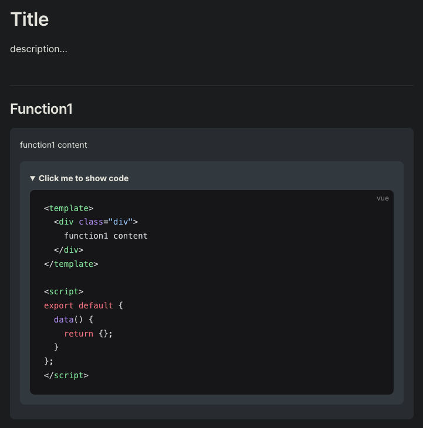

# vitepress-plugin-component-demo

Vitepress component demo block in markdown.

## Install

`npm i -D vitepress-plugin-component-demo`

## Usage

Directory Structure

```
.
├── docs
│   ├── .vitepress
│   │   ├── components
│   │   │   ├── function1.vue
│   │   │   └── function2.vue
│   │   ├── theme
│   │   │   └── index.ts
│   │   └── config.mts
│   └── README.md
```

config.mts

```ts
import { defineConfig } from 'vitepress';

export default defineConfig({
  optimizeDeps: {
    // node_modules is unresolved, exclude this to resolve it
    exclude: ['vitepress-plugin-component-demo']
  }
})
```

theme/config.ts

```ts
import DefaultTheme from 'vitepress/theme';

import type { Theme } from 'vitepress';

import { enhanceApp } from 'vitepress-plugin-component-demo';

export default {
  extends: DefaultTheme,
  enhanceApp(context) {
    enhanceApp({
      ...context,
      components: import.meta.glob('../components/**/*.vue'),
    });
  },
} as Theme;
```

README.md

```md
# Title

description...

## Function1

<demo name="function1" />
```

[Result](./function1.md)



## Options

| Name  | Desc                                          | Example                                               |
| ----- |-----------------------------------------------| ----------------------------------------------------- |
| name  | component name with `./vitepress/components/` | `<demo name="function1" />`                           |
| title | demo block title                              | `<demo name="function1" title="function1 desc..." />` |

## Extends

Use custom demo block:

```
.
├── docs
│   ├── .vitepress
│   │   ├── components
│   │   │   ├── custom-demo.vue
```

custom-demo.vue

```vue
<template>
  <div v-html="code"></div>
</template>

<script>
import { getDemoCode } from "vitepress-plugin-component-demo/lib/es/demo-codes.js";

export default {
  props: {
    name: String,
  },
  data() {
    return {
      code: ''
    }
  },
  mounted() {
    getDemoCode(this.name).then((res) => {
      this.code = res;
    })
  }
};
</script>
```

README.md

```md
<custom-demo name="function1" />
```
